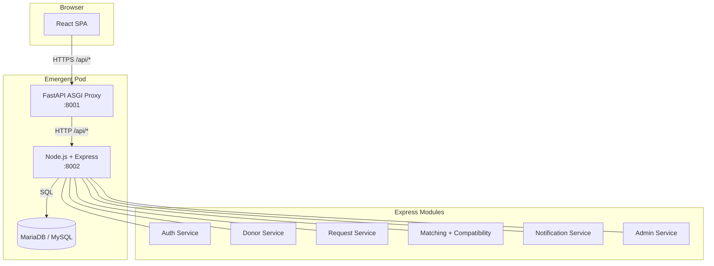

# RedPulse — Blood Bank & Donor Locator

> **Find Blood. Save Lives.** — A production-style Blood Bank & Donor Locator
> web application built for a B.Tech Computer Science backend project.

---

## 1. Problem Statement

Locating a compatible blood donor during a medical emergency is currently
manual, slow and geographically inefficient. Recipients call blood banks, wait
for responses, and often don't know which of the eight blood groups they can
safely receive. Donors, on the other hand, rarely find out when their blood
type is urgently needed nearby.

## 2. Proposed Solution

**RedPulse** connects donors, recipients and administrators on a single
platform:

- Recipients broadcast urgent blood requests with hospital location.
- The backend uses the **Haversine formula** and clinical **red-blood-cell
  compatibility rules** to instantly match compatible, available, verified
  donors within a chosen radius (5 / 10 / 25 / 50 / 100 km).
- Donors receive in-app notifications and can accept or decline.
- Administrators verify donors, monitor blood banks, and oversee live
  request/donation activity.

---

## 3. Technology Stack

| Layer            | Technology                                                |
|------------------|-----------------------------------------------------------|
| **Frontend**     | React 19 · React Router · Tailwind CSS · Leaflet · lucide-react · sonner |
| **Backend**      | **Node.js 20 · Express 4 · MySQL (MariaDB) · JWT · bcryptjs** |
| **Database**     | MySQL 8 / MariaDB 10.11 (relational schema, 8 tables)     |
| **Auth**         | JSON Web Tokens (HS256), bcrypt password hashing, role-based middleware, rate-limited auth endpoints |
| **Maps**         | Leaflet + OpenStreetMap (free, no key). Falls back to a list if browser lacks WebGL. Google Maps key optional. |
| **Notifications**| Firebase Cloud Messaging *architecture* + in-app notification store. Runs in **mock mode** without credentials. |
| **Deployment**   | Emergent platform (uvicorn ASGI proxy → Node.js on port 8002 → MySQL) |

> **Note on the ASGI proxy:** Emergent's supervisor is locked to
> `uvicorn server:app`. `/app/backend/server.py` is therefore a *thin FastAPI
> reverse-proxy* that starts MariaDB + Node.js on boot and forwards every
> `/api/*` request to Express on port 8002. All business logic — auth, DB
> access, compatibility, matching, notifications — lives in `/app/server`
> (Node.js). Locally you can bypass the proxy entirely and just run
> `node /app/server/index.js`.

---

## 4. Architecture



Each Express module lives in its own file under `/app/server/controllers` and
`/app/server/services`, so any of them can later be extracted into a stand-
alone microservice without touching the frontend contract.

---

## 5. Database Schema

Eight normalized MySQL tables with foreign keys, indexes and enum constraints:

- `users` — accounts (donor / recipient / admin)
- `donors` — donor profile (blood group, geo, availability, verification)
- `recipients` — recipient profile
- `blood_banks` — locations with supported blood groups
- `blood_requests` — urgent requests
- `donor_requests` — donor ↔ request response (accept / reject / complete)
- `donation_history` — completed donations
- `notifications` — in-app notification store

Full DDL lives at [`/app/server/database/schema.sql`](server/database/schema.sql).
A one-shot wrapper is available at `/app/database.sql` and `/app/schema.sql`.

---

## 6. Blood Group Compatibility (Red Blood Cell)

| Donor | Can Give To                            |
|-------|-----------------------------------------|
| O-    | O-, O+, A-, A+, B-, B+, AB-, AB+ (universal donor) |
| O+    | O+, A+, B+, AB+                         |
| A-    | A-, A+, AB-, AB+                        |
| A+    | A+, AB+                                 |
| B-    | B-, B+, AB-, AB+                        |
| B+    | B+, AB+                                 |
| AB-   | AB-, AB+                                |
| AB+   | AB+                                     |

This is enforced in `/app/server/services/compatibilityService.js` and used by
`GET /api/donors/nearby` and `POST /api/requests`.

---

## 7. Location-Based Donor Search

`/api/donors/nearby` accepts `latitude`, `longitude`, `blood_group`,
`radius_km` (5/10/25/50/100), `verified_only`, `available_only` and returns
only compatible, active, in-radius donors sorted by nearest distance.
Distances are computed with the Haversine formula (see
[`matchingService.js`](server/services/matchingService.js)).

---

## 8. REST API

Base URL: `<REACT_APP_BACKEND_URL>/api`

### Auth
| Method | Path | Description |
|--------|------|-------------|
| POST | `/auth/register` | Create donor / recipient account |
| POST | `/auth/login` | Email + password → JWT |
| POST | `/auth/demo-login` | `{"role":"donor"\|"recipient"\|"admin"}` one-click demo login |
| POST | `/auth/logout` | Client-side logout (JWT is stateless) |
| GET  | `/auth/me` | Current user + profile |

### Donors
| Method | Path |
|--------|------|
| GET  | `/donors` (`?blood_group&city&verified_only&available_only`) |
| GET  | `/donors/nearby` (`?blood_group&latitude&longitude&radius_km&…`) |
| GET  | `/donors/:id` |
| PUT  | `/donors/:id` |
| PATCH | `/donors/:id/availability` |
| DELETE | `/donors/:id` |

### Recipients
`GET/PUT /recipients/:id`

### Blood Requests
`POST/GET /requests`, `GET/PATCH /requests/:id`,
`PATCH /requests/:id/status`, `DELETE /requests/:id`

### Donor Requests (donor ↔ request responses)
`GET /donor-requests`, `PATCH /donor-requests/:id`

### Donation History
`POST/GET /donations`, `GET /donations/:id`

### Blood Banks
`GET/POST /blood-banks`, `GET/PUT/DELETE /blood-banks/:id`

### Admin (JWT + role=admin)
| Method | Path |
|--------|------|
| GET   | `/admin/dashboard` |
| GET   | `/admin/users` |
| PATCH | `/admin/users/:id/status` |
| PATCH | `/admin/donors/:id/verify` |
| GET   | `/admin/requests` |
| GET   | `/admin/donations` |
| POST  | `/admin/seed-reset` |

### Notifications
`GET /notifications`, `PATCH /notifications/:id/read`,
`POST /notifications/mark-all-read`,
`POST /notifications/fcm-token`, `GET /notifications/fcm-config`

### System
`GET /system/compatibility?blood_group=B%2B`, `GET /system/config`

All responses follow:

```json
{ "success": true,  "data": {...} }
{ "success": false, "detail": "Human readable error" }
```

---

## 9. Environment Variables

All secrets live in `.env` files. **Nothing is hard-coded.**

`/app/server/.env`
```env
PORT=8002
MYSQL_HOST=127.0.0.1
MYSQL_PORT=3306
MYSQL_USER=bloodbank
MYSQL_PASSWORD=bloodbank_pass_2026
MYSQL_DATABASE=bloodbank
JWT_SECRET=redpulse_super_secret_change_in_prod_2026
JWT_EXPIRES_IN=7d
BCRYPT_ROUNDS=10
GOOGLE_MAPS_API_KEY=            # optional; if blank we use Leaflet + OSM
FCM_ENABLED=false
FCM_SERVER_KEY=                 # optional; blank = mock notifications
CORS_ORIGINS=*
```

`/app/frontend/.env` (managed by Emergent — do NOT edit)
```
REACT_APP_BACKEND_URL=https://<your-pod>.preview.emergentagent.com
```

---

## 10. Local Setup (Standalone / Non-Emergent)

```bash
# 1. Install MySQL / MariaDB and start it.
sudo apt install -y mariadb-server
sudo service mariadb start

# 2. Provision database
sudo mysql < /app/database.sql

# 3. Backend
cd /app/server
yarn install
cp .env .env.local  # edit MYSQL_PASSWORD / JWT_SECRET
node database/init.js --force   # apply schema + seed demo data
node index.js                   # http://localhost:8002

# 4. Frontend
cd /app/frontend
yarn install
yarn start                      # http://localhost:3000
```

## Running inside Emergent (already configured)

Supervisor auto-starts the FastAPI proxy at `:8001`, which in turn boots
MariaDB + Node.js on `:8002` and forwards `/api/*` transparently.

- Preview URL: value of `REACT_APP_BACKEND_URL` in `/app/frontend/.env`
- Restart backend: `sudo supervisorctl restart backend`
- Reset demo data: `curl -X POST -H "Authorization: Bearer <admin-jwt>" \
    <api>/api/admin/seed-reset`

---

## 11. Demo Credentials

See [`/app/memory/test_credentials.md`](memory/test_credentials.md) for the
full list. Highlights:

| Role      | Email                        | Password    |
|-----------|------------------------------|-------------|
| Admin     | admin@redpulse.dev           | admin@123   |
| Donor     | donor.john@redpulse.dev      | password123 |
| Recipient | recipient.msh@redpulse.dev   | password123 |

Or just click one of the **"Demo Donor / Demo Recipient / Demo Admin"**
buttons in the frontend login modal.

---

## 12. Google Maps & Firebase — Configuration

Both are **optional and produce clear fallback behaviour** if credentials are
missing:

- **Google Maps** — Frontend uses free Leaflet + OpenStreetMap by default.
  Provide `REACT_APP_GOOGLE_MAPS_API_KEY` if you wish to swap in Google Maps.
- **Firebase Cloud Messaging** — With `FCM_ENABLED=false` (default),
  notifications are written to the `notifications` table and shown in the
  Notification Drawer. Set `FCM_ENABLED=true` and `FCM_SERVER_KEY=<key>` in
  `server/.env` to enable real device push (integration point is
  `notificationService.js`).

`GET /api/notifications/fcm-config` and `GET /api/system/config` expose the
current state so the UI can display a clear "FCM not configured" hint.

---

## 13. Testing

- **API smoke tests:** see `/app/tests` for a Node/Supertest suite.
- **Manual verification:** the "Quick Demo Login" buttons plus
  `/app/memory/test_credentials.md` cover every role in seconds.
- **Curl example** (nearby B+ donors):

```bash
curl "$BASE/api/donors/nearby?blood_group=B%2B&latitude=40.7128&longitude=-74.006&radius_km=25"
```

---

## 14. Future Scope

- Real FCM push notifications and SMS fallback (Twilio).
- Swap Leaflet for Google Maps Platform when a paid key is provisioned.
- Extract Auth / Matching / Notification services into stand-alone
  microservices (already isolated as files today).
- Blood bank inventory ledger and expiry tracking.
- Nurse / hospital sub-role with request routing.

---

© 2026 RedPulse — Blood Bank & Donor Locator. B.Tech CSE project.
